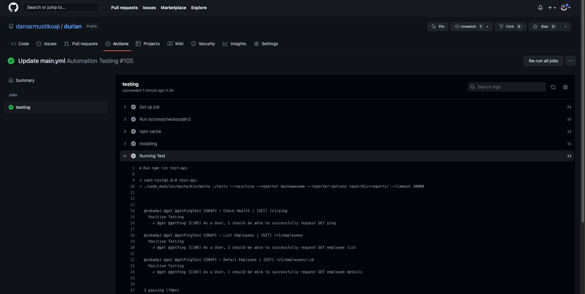
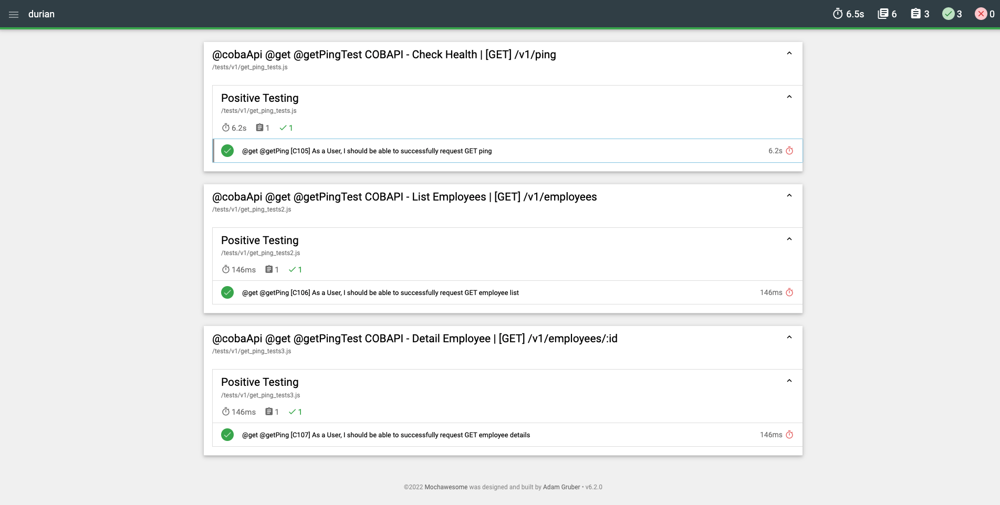
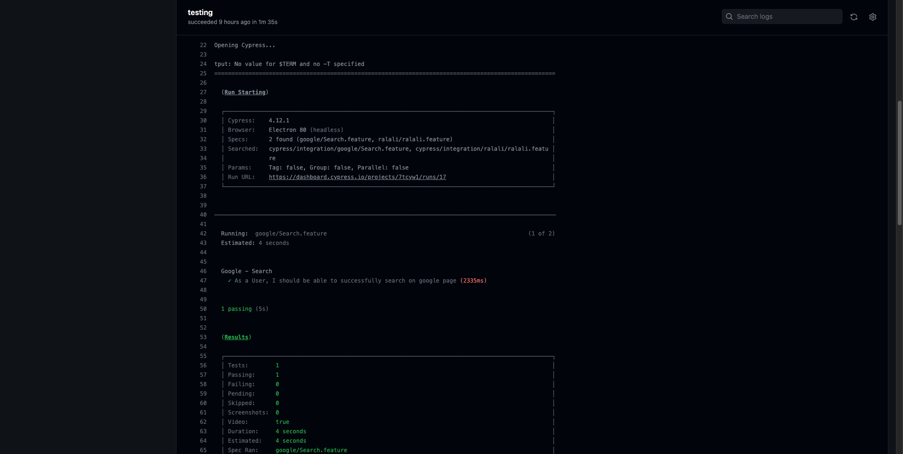
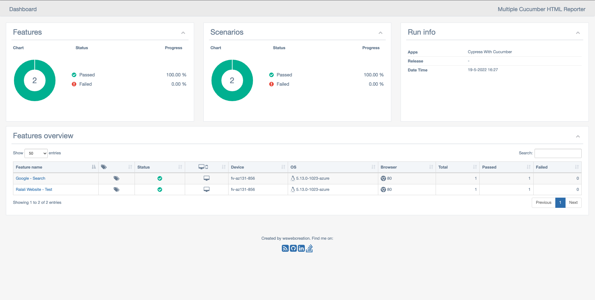
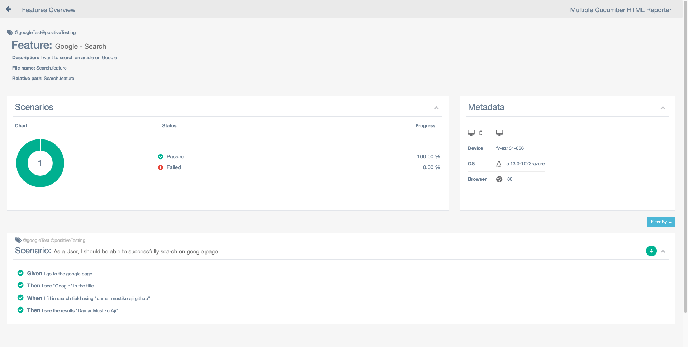
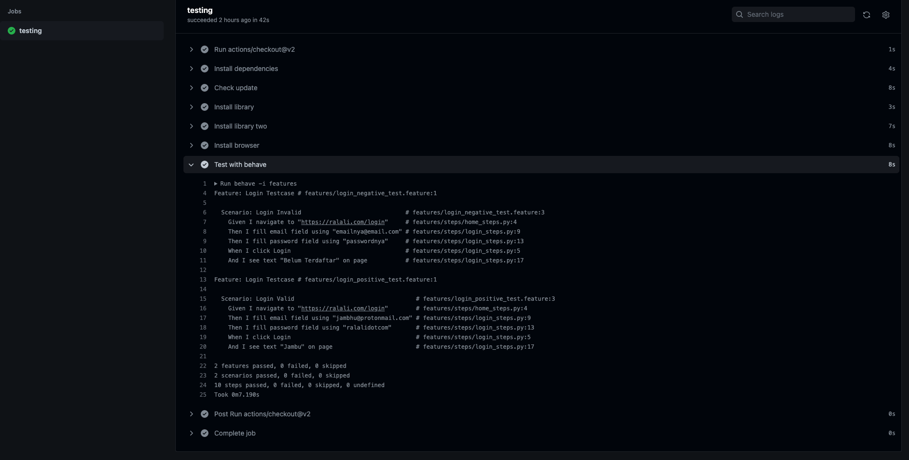

Having more than 5 years of experience as a Quality Assurance Engineer. Dedicated to ensuring the quality of software products by testing products and solving problems. I have an interest in automation testing. A software tester, who likes to learn a new thing about technology to increase the testing ability skill.

### Experience

**November 2020 to now**

**`Quality Assurance Specialist - SDET` [LINKAJA](https://www.linkaja.id), Yogyakarta**
> - Working in the squads to create
the Automated testing on the User Interface and API, and also maintain the integration test (CICD).
- Creating scripts for performance tests
- Research on the automation test tools
- Support sanity testing on release deployment
- The product: Promo and Loyalty Points, Smartbiller - Digital Goods, and E-Kyc Management (microservice-based).

*March 2019 to October 2020*

**`Quality Engineer` [RALALI.COM](https://www.ralali.com), Yogyakarta**
> - Working in the squad on the Fintech tribe to do creating
the test case and testing on the User Interface and API.
- On every sprint creating the automation testing on API
and UI related to the feature, and also maintaining
integration test on CI-CD.
- The Fintech tribe has a product: Wallet, Billing, and R-
Credit.

*September 2018 to February 2019*

**`Quality Assurance Engineer` [MAUKERJA.ID](https://www.maukerja.id) / [A JOB THING](https://www.maukerja.id), Yogyakarta**
> - Working with the team to do creating the test case,
manually testing on functionality, and also performance
testing.
- Creating automation testing on the website and android
mobile apps.
- The Product: Soulusi.com web and mobile apps, EasyEarn mobile apps, and social credit microservices.

*September 2017 to Augustus 2018*

**`Quality Assurance Engineer` [WONDERLABS](https://wonderlabs.io), Yogyakarta**

*July 2017 to Augustus 2017*

**`Quality Assurance Automation Specialist` [SEBANGSA](https://sebangsa.com), Yogyakarta**

*March 2015 to June 2017*

**`Quality Assurance` [SEBANGSA](https://sebangsa.com), Yogyakarta**

### Highlights

- Manual Testing: website, mobile apps (android, ios), API (backend) 
- Automation Testing: Website, API, Mobile apps (android)
- Creating Test cases and Management
- Basic Knowledge of query language (MySQL, Postgres)
- Writing script tests using the programming language
- Familiar and used to: git (GitHub, GitLab) activities, dashboard monitoring log (grafana, datadog, kibana)

### Tools

- TestRails Management [* * * *]()
- Jira and Confluence (atlassian) [* * * *]()
- Trello [* * *]()
- Postman [* * * * *]()
- Table Plus [* * * *]()
- Visual Studio Code [* * * *]()
- Github and Gitlab [* * * *]()
- Ngrok and Mockoon (for Mocking Case) [* * *]()
- Grafana [* * *]()
- Kibana [* * *]()
- Datadog [* * *]()
- K6 (for Performance Test) [* * *]()
- Cypress [* * *]()
- Selenium WebDriver [* * *]()
- Appium [* * *]()
- Robot Framework [* * * *]()
- Mocha and Chai [* * * * *]()
- Katalon [* * *]()
- Cucumber [* * *]()
- Docker [*]()
- Word, Spreadsheet (excel) [* * * * *]()

### Programming

- PHP [* * *]()
- Python [* * *]()
- JavaScript [* * * *]()
- Java [*]()

Scale:
1. understand   [* *]
2. familiar     [* * * *]
3. part of life [* * * * *]

### Portfolio

- Reqress.in Test - NodeJS Mocha & Chai [API AT]
  - Run https://github.com/damarmustikoaji/durian/actions
    
  - Reports
    
- Google.com Test - Cypress & Cucumber [WEB AT]
  - Run https://github.com/damarmustikoaji/timun/actions
    
  - Reports
    
    
- Ralali.com Test - Python & Behave (cucumber) [WEB AT]
  - Run https://github.com/damarmustikoaji/mangga/actions/workflows/main.yml
    
- For more detail check on [Repository](https://github.com/damarmustikoaji?tab=repositories)

### Contact

Have trouble with me? Check out  the [documentation](https://www.linkedin.com/in/damar-mustikoaji/) to help you sort it out.
